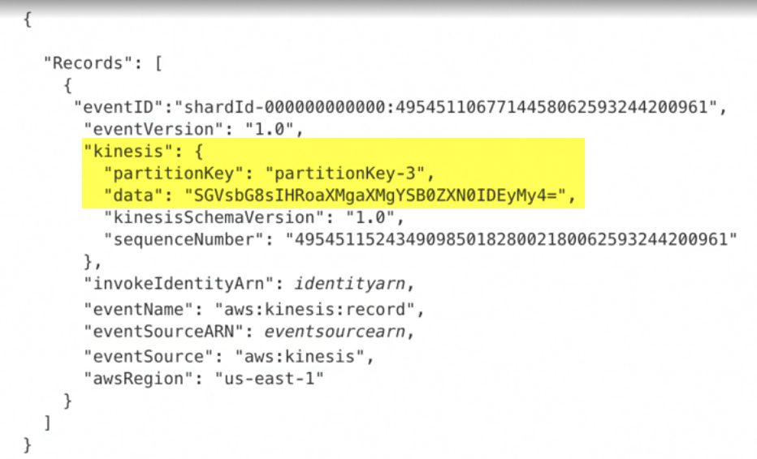

serverless.yml

```yml
functions:
  notifyProducer:
    handler: handler.notifyProducer
    events:
      - stream:
          arn: arn:aws:kinesis:#{AWS::Region}:#{AWS::AccountId}:stream/order-events-stream
```

handler.js

```js
const { getRecords } = require("./kinesisHelper");

module.exports.notifyProducer = async (event) => {
  const records = getRecords(event);
  console.log("records", records);
  const ordersPlaced = records.filter(
    (r) => r.eventType === EVENT_TYPES.ORDER_PLACED
  );
  console.log("ordersPlaced", ordersPlaced);
  return createResponse(200, ordersPlaced);
};
```

Example of kinesis event object



kinesisHelper.js

```js
const parsePayload = (record) => {
  const jsonStr = new Buffer(record.kinesis.data, "base64").toString("utf8");
  return JSON.parse(jsonStr);
};

const getRecords = (event) => {
  return event.Records.map(parsePayload);
};

module.exports = {
  parsePayload,
  getRecords,
};
```
